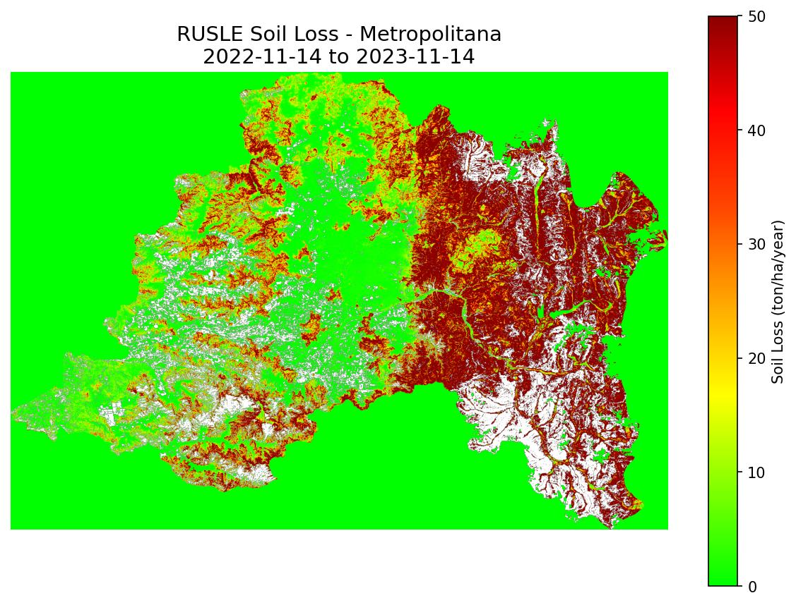
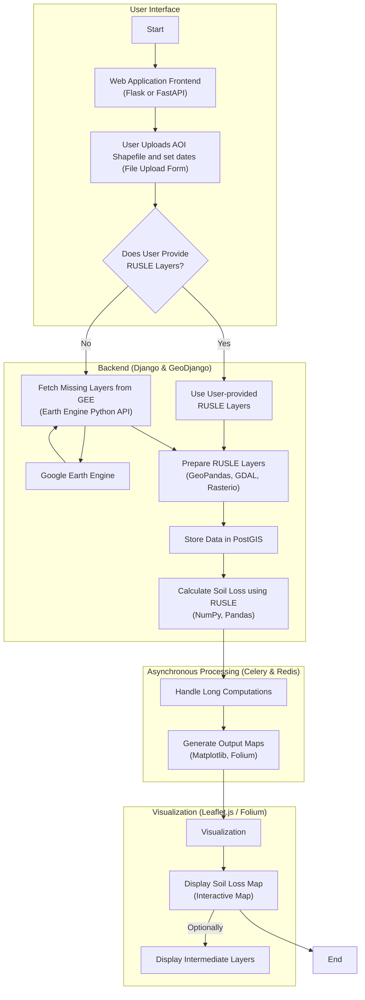

# RUSLE - Revised Universal Soil Loss Equation

Implementation of the RUSLE model using Google Earth Engine and Python.

## Example Output



*Soil loss estimation for the Metropolitana Region, Chile (2022-11-14 to 2023-11-14)*

---

## Quick Start

### Prerequisites

- [uv](https://docs.astral.sh/uv/) - Fast Python package installer
- Python 3.10+ (managed automatically by uv)
- Google Earth Engine account

### Installation

```bash
# Clone the repository
git clone <repo-url>
cd RUSLE

# Install dependencies with uv (creates .venv automatically)
uv sync

# Activate the virtual environment
source .venv/bin/activate  # Linux/macOS
# or
.venv\Scripts\activate     # Windows
```

### Running the Notebook

1. Open VS Code and select the `.venv` Python interpreter
2. Open `00_scripts/RUSLE.ipynb`
3. Run the cells sequentially

### Google Earth Engine Setup

1. Create a GEE project at [Google Cloud Console](https://console.cloud.google.com/)
2. Enable the Earth Engine API
3. Update `GEE_PROJECT` in the notebook with your project ID

---

# Specifications

+ The tool has to be hosted/deployed as a web app:
+ It will receive as input a shapefile with the area of interest (aoi) and the range of dates to perform the calculation.
+ It will calculate the soils loss based in the (Revised Universal Soil Loss Equation) RUSLE equation.
    + It will give the option to the user to load his own layers for the RUSLE as shapefiles.
    + If some layer is not provided, it will use the remote sensing proxies retrieved from Google Earth Engine (using python API).
+ The output will be visualized as a map showing the soil loss and alternativelly, it will display the intermediate layers for the calculation of it.



# Project structure

```graphql
soil_loss_app/
│
├── app/
│   ├── main.py                    # Main entry point for running the web app
│   ├── config.py                  # Configuration settings (API keys, GEE credentials, etc.)
│   ├── routers/
│   │   ├── __init__.py            # Initialization for routers
│   │   ├── upload.py              # Router to handle file uploads
│   │   ├── process.py             # Router to handle RUSLE processing logic
│   │   └── visualize.py           # Router to handle visualization endpoints
│   ├── services/
│   │   ├── __init__.py            # Initialization for services
│   │   ├── rusle_calculator.py    # RUSLE calculation logic
│   │   ├── gee_fetcher.py         # Module to fetch data from Google Earth Engine
│   │   └── shapefile_handler.py   # Module to handle shapefile processing with Geopandas
│   ├── static/
│   │   ├── css/                   # CSS stylesheets for the web app
│   │   └── js/                    # JavaScript files if needed
│   ├── templates/                 # HTML templates for the web app (if using Flask)
│   │   ├── index.html             # Main page template
│   │   └── results.html           # Results display template
│   └── utils/
│       ├── __init__.py            # Initialization for utility functions
│       ├── data_validation.py     # Functions to validate user inputs and data
│       └── map_visualizer.py      # Utility for creating maps with Folium or other libraries
│
├── tests/
│   ├── test_rusle_calculator.py   # Unit tests for RUSLE calculation
│   ├── test_gee_fetcher.py        # Unit tests for Google Earth Engine integration
│   └── test_endpoints.py          # Tests for API endpoints
│
├── data/
│   ├── sample_shapefiles/         # Sample shapefiles for testing
│   └── output/                    # Directory for storing output results
│
├── docs/
│   └── project_diagram.md         # Project diagram and documentation
│
├── requirements.txt               # Python dependencies
├── README.md                      # Project overview and instructions
└── .gitignore                     # Files and directories to be ignored by Git

```


# Description

The **Revised Universal Soil Loss Equation (RUSLE)** is an empirical model used to estimate the average annual rate of soil erosion caused by rainfall and associated surface runoff. The equation calculates soil loss by considering various environmental and land management factors. The RUSLE equation is expressed as:

```math
A = R \times K \times LS \times C \times P
```

Where:

1. **A (Average Annual Soil Loss)**:
   - Represents the computed average soil loss per unit area, typically expressed in tons per acre or metric tons per hectare per year.
   - It is the end result of the equation, indicating the potential long-term average soil erosion.

2. **R (Rainfall-Runoff Erosivity Factor)**:
   - Quantifies the effect of raindrop impact and the amount and rate of runoff likely to be associated with the rain.
   - It is based on the intensity and duration of rainfall in a specific area.
   - Areas with heavy, intense rains have higher R-values, indicating a greater potential for soil erosion.

3. **K (Soil Erodibility Factor)**:
   - Reflects the susceptibility of soil particles to detachment and transport by rainfall and runoff.
   - It is influenced by soil properties such as texture, structure, organic matter content, and permeability.
   - Soils with high silt content and low organic matter are typically more erodible.

4. **LS (Slope Length and Steepness Factor)**:
   - Accounts for the influence of topography on erosion rates.
   - **L (Slope Length Factor)**: Represents the effect of slope length on erosion. Longer slopes contribute to more erosion due to the accumulation of runoff.
   - **S (Slope Steepness Factor)**: Represents the effect of slope gradient. Steeper slopes increase the velocity of runoff, enhancing its erosive power.
   - The combined LS factor increases with both slope length and steepness.

5. **C (Cover-Management Factor)**:
   - Indicates the effect of cropping and management practices on soil erosion rates.
   - It compares the soil loss from land under specific crop and management conditions to that from continuously tilled fallow land.
   - Vegetative cover, crop residues, and soil cover practices reduce the C factor, thus lowering soil erosion.

6. **P (Support Practice Factor)**:
   - Reflects the impact of practices that reduce the amount and rate of water runoff and thus soil erosion.
   - Examples include contour farming, strip cropping, terracing, and the use of sediment control structures.
   - Effective support practices decrease the P factor value, leading to reduced soil loss.

---

**Summary of RUSLE Components**:

- **A**: Estimated average soil loss per unit area (output of the equation).
- **R**: Rainfall-runoff erosivity factor (climatic influence).
- **K**: Soil erodibility factor (soil properties).
- **LS**: Topographic factor combining slope length (**L**) and slope steepness (**S**).
- **C**: Cover-management factor (land use and vegetation cover).
- **P**: Support practice factor (soil conservation measures).

---

**Application in Your Web App**:

In the context of your web application:

- **User Inputs**:
  - Users can upload shapefiles representing their area of interest (AOI).
  - They may also provide layers corresponding to any of the RUSLE factors (**R**, **K**, **LS**, **C**, **P**).

- **Data Retrieval**:
  - For any missing layers, the application can retrieve appropriate data proxies from **Google Earth Engine (GEE)** using its Python API.

- **Processing**:
  - The application will compute each factor based on the provided or retrieved data.
  - It will then calculate the average annual soil loss (**A**) for the AOI using the RUSLE equation.

- **Visualization**:
  - The results, including the computed soil loss and intermediate factor layers, will be visualized on an interactive map.
  - This allows users to understand not only the overall erosion risk but also the contributing factors.

---

**Importance of Each Component**:

Understanding each component is crucial for accurate soil loss estimation and effective soil conservation planning:

- **Rainfall (R)**: Helps identify periods and areas of high erosive rainfall, guiding the timing of soil conservation measures.
- **Soil (K)**: Indicates which soils are more vulnerable, informing soil management and amendment strategies.
- **Topography (LS)**: Highlights areas where terrain exacerbates erosion, suggesting where to implement terracing or other slope management practices.
- **Cover (C)**: Emphasizes the role of vegetation and ground cover, promoting practices like cover cropping or mulching.
- **Practices (P)**: Demonstrates the effectiveness of erosion control measures, aiding in the selection of appropriate conservation techniques.

---

**References**:

- Renard, K.G., Foster, G.R., Weesies, G.A., McCool, D.K., & Yoder, D.C. (1997). *Predicting Soil Erosion by Water: A Guide to Conservation Planning with the Revised Universal Soil Loss Equation (RUSLE)*. USDA Agricultural Handbook No. 703.
- [USDA Natural Resources Conservation Service (NRCS) - RUSLE](https://www3.epa.gov/npdes/pubs/ruslech2.pdf)

---
