# RUSLE - Revised Universal Soil Loss Equation

[](https://nriveras.github.io/RUSLE/)

Implementation of the RUSLE model using Google Earth Engine and Python, available both as a Jupyter notebook and a web application.

📖 **[View Full Documentation](https://nriveras.github.io/RUSLE/)**

## Example Output


*Soil loss estimation for Germany (2021-01-20 to 2022-01-20)*

---

## Quick Start

### Prerequisites

- [uv](https://docs.astral.sh/uv/) - Fast Python package installer
- Python 3.10+ (managed automatically by uv)
- [Google Earth Engine account](https://courses.spatialthoughts.com/gee-sign-up.html)

### Installation

```bash
# Clone the repository
git clone https://github.com/nriveras/RUSLE.git
cd RUSLE

# Install dependencies with uv (creates .venv automatically)
uv sync

# Activate the virtual environment
source .venv/bin/activate  # Linux/macOS
# or
.venv\Scripts\activate     # Windows
```

### Option 1: Run the Web Application

```bash
# Start the web server
python run.py

# Or with auto-reload for development
python run.py --reload
```

Open your browser at **http://localhost:8000/app**

The web application allows you to:
- Upload shapefiles (ZIP) or GeoJSON files as area of interest
- Select an administrative region by name (uses FAO GAUL boundaries)
- Specify date range for analysis
- Visualize soil loss and all RUSLE factors on an interactive map
- Toggle individual layers (R, K, L, S, C, P factors)
- Export results to Google Drive

### Option 2: Run the Jupyter Notebook

1. Open VS Code and select the `.venv` Python interpreter
2. Open `00_scripts/RUSLE.ipynb`
3. Run the cells sequentially

### Google Earth Engine Setup

1. Create a GEE project at [Google Cloud Console](https://console.cloud.google.com/)
2. Enable the Earth Engine API
3. Register for Earth Engine at [https://earthengine.google.com/signup/](https://earthengine.google.com/signup/)
4. Update `GEE_PROJECT` in the notebook or create a `.env` file:
   ```bash
   cp .env.example .env
   # Edit .env with your project ID
   ```

### Option 3: Run with Docker

```bash
# Build the Docker image
docker build -t rusle-app .

# Run with docker-compose (recommended)
docker-compose up -d

# Or run directly with Docker
docker run -d \
  -p 8000:8000 \
  -v ~/.config/earthengine:/home/appuser/.config/earthengine:ro \
  -e RUSLE_GEE_PROJECT=your-project-id \
  rusle-app
```

**Note:** You must authenticate with GEE locally first (`earthengine authenticate`) before running the container, as it mounts your credentials.

---

## Project Structure

```
RUSLE/
├── app/                          # Web application (FastAPI)
│   ├── __init__.py
│   ├── main.py                   # FastAPI entry point
│   ├── config.py                 # Configuration (pydantic-settings)
│   ├── routers/
│   │   ├── upload.py             # POST /api/upload
│   │   ├── process.py            # POST /api/process
│   │   └── visualize.py          # GET /api/visualize/{job_id}
│   ├── services/
│   │   ├── gee_service.py        # Google Earth Engine integration
│   │   ├── rusle_calculator.py   # RUSLE factor calculations
│   │   └── shapefile_handler.py  # Shapefile/GeoJSON processing
│   ├── static/
│   │   ├── css/style.css         # Application styles
│   │   └── js/app.js             # Leaflet map & API interactions
│   └── templates/
│       └── index.html            # Main application page
│
├── 00_scripts/
│   ├── RUSLE.ipynb               # Jupyter notebook implementation
│   ├── rusle_utils.py            # RUSLE calculation utilities
│   └── gee_auth.py               # GEE authentication helper
│
├── 01_references/                # Reference materials
├── 02_input/                     # Input shapefiles
├── 03_output/                    # Generated outputs
├── data/
│   ├── uploads/                  # Web app file uploads
│   └── output/                   # Web app outputs
│
├── run.py                        # Web app entry point
├── pyproject.toml                # Dependencies (uv)
├── .env.example                  # Environment template
└── README.md
```

---

## Web Application

### API Endpoints

| Endpoint | Method | Description |
|----------|--------|-------------|
| `/app` | GET | Main application page |
| `/api/upload` | POST | Upload shapefile (ZIP) or GeoJSON |
| `/api/upload/{session_id}/preview` | GET | Preview uploaded AOI as GeoJSON |
| `/api/process` | POST | Run RUSLE calculation |
| `/api/process/{job_id}/statistics` | GET | Get result statistics |
| `/api/process/{job_id}/export` | POST | Export to Google Drive |
| `/api/visualize/{job_id}` | GET | Get map layer configuration |
| `/api/visualize/{job_id}/folium` | GET | Get embeddable Folium HTML map |
| `/api/legend` | GET | Get soil loss legend classes |
| `/health` | GET | Health check endpoint |

### Process Request Example

```bash
curl -X POST http://localhost:8000/api/process \
  -H "Content-Type: application/json" \
  -d '{
    "admin_region": "Metropolitana",
    "date_from": "2022-01-01",
    "date_to": "2023-01-01",
    "dem_source": "SRTM",
    "export_scale": 90
  }'
```

### Architecture

```mermaid
graph TD
    subgraph "User Interface"
        Start[Start] --> UI["Web Application<br>(FastAPI + Leaflet.js)"]
        UI --> InputAOI["Upload Shapefile/GeoJSON<br>OR Select Admin Region"]
        InputAOI --> SetDates["Set Date Range"]
    end

    subgraph "Backend (FastAPI)"
        SetDates --> FetchLayers["Fetch Data from GEE"]
        FetchLayers --> GEE["Google Earth Engine"]
        GEE --> |Precipitation| R["R Factor<br>(CHIRPS)"]
        GEE --> |Soil Data| K["K Factor<br>(OpenLandMap)"]
        GEE --> |DEM| LS["L & S Factors<br>(SRTM/MERIT)"]
        GEE --> |Landsat 8| C["C Factor<br>(NDVI)"]
        GEE --> |Land Cover| P["P Factor<br>(MODIS 061)"]
        R & K & LS & C & P --> Calculate["A = R × K × L × S × C × P"]
    end

    Calculate --> TileURL["Generate Tile URLs"]

    subgraph "Visualization (Leaflet.js)"
        TileURL --> Map["Interactive Map"]
        Map --> |Toggle| Layers["Layer Control"]
        Layers --> SoilLoss["Soil Loss"]
        Layers --> Factors["R, K, L, S, C, P Factors"]
    end

    Map --> Export["Export to Google Drive"]
    Map --> End[End]
```



---

## Data Sources

| Factor | Data Source | Resolution | Dataset ID |
|--------|-------------|------------|------------|
| **R** (Rainfall Erosivity) | CHIRPS Daily | 5.5 km | `UCSB-CHG/CHIRPS/DAILY` |
| **K** (Soil Erodibility) | OpenLandMap | 250 m | `OpenLandMap/SOL/*` |
| **L, S** (Topography) | SRTM / MERIT | 30 m / 90 m | `USGS/SRTMGL1_003` |
| **C** (Vegetation Cover) | Landsat 8 SR | 30 m | `LANDSAT/LC08/C02/T1_L2` |
| **P** (Erosion Control) | MODIS Land Cover | 500 m | `MODIS/061/MCD12Q1` |

---

## RUSLE Equation

The **Revised Universal Soil Loss Equation (RUSLE)** estimates average annual soil erosion:

$$A = R \times K \times L \times S \times C \times P$$

Where:

| Factor | Name | Description | Unit |
|--------|------|-------------|------|
| **A** | Soil Loss | Average annual soil loss | ton/ha/year |
| **R** | Rainfall Erosivity | Effect of rainfall intensity | MJ·mm/(ha·h·yr) |
| **K** | Soil Erodibility | Susceptibility of soil to erosion | t·ha·h/(ha·MJ·mm) |
| **L** | Slope Length | Effect of slope length | dimensionless |
| **S** | Slope Steepness | Effect of slope gradient | dimensionless |
| **C** | Cover Management | Effect of vegetation cover | dimensionless |
| **P** | Support Practices | Effect of conservation practices | dimensionless |

### Factor Calculations

- **K Factor** (Williams, 1995): Based on sand, silt, clay, and organic carbon content
- **R Factor**: R = 0.0483 × P^1.610 where P is annual precipitation
- **L Factor**: L = (λ / 22.13)^m where m varies with slope
- **S Factor**: S = (0.43 + 0.3S + 0.043S²) / 6.613
- **C Factor** (De Jong, 1994): C = 0.431 - 0.805 × NDVI
- **P Factor**: Based on MODIS land cover classification (Chuenchum et al., 2019)

---

## Soil Loss Classification

| Range (ton/ha/yr) | Class | Color |
|-------------------|-------|-------|
| 0 - 5 | Very Low | � Dark Purple (#440154) |
| 5 - 10 | Low | 🟣 Purple (#482878) |
| 10 - 20 | Moderate | 🔵 Blue (#31688e) |
| 20 - 30 | High | 🟢 Teal (#1f9e89) |
| 30 - 40 | Very High | 🟢 Green (#35b779) |
| 40 - 50 | Severe | 🟡 Lime (#b5de2b) |
| > 50 | Very Severe | 🟡 Yellow (#fde725) |

---

## References

1. Renard, K.G., Foster, G.R., Weesies, G.A., McCool, D.K., & Yoder, D.C. (1997). *Predicting Soil Erosion by Water: A Guide to Conservation Planning with the Revised Universal Soil Loss Equation (RUSLE)*. USDA Agricultural Handbook No. 703.

2. Williams, J.R. (1995). The EPIC Model. In V.P. Singh (Ed.), *Computer Models of Watershed Hydrology*. Water Resources Publications.

3. De Jong, S.M. (1994). Derivation of vegetative variables from a Landsat TM image for modelling soil erosion. *Earth Surface Processes and Landforms*, 19(2), 165-178.

4. Chuenchum, P., Xu, M., & Tang, W. (2019). Estimation of soil erosion and sediment yield in the Lancang–Mekong river using the modified revised universal soil loss equation and GIS techniques. *Water*, 12(1), 135.

5. Uddin, K., Abdul Matin, M., & Maharjan, S. (2018). Assessment of land cover change and its impact on changes in soil erosion risk in Nepal. *Sustainability*, 10(12), 4715.

---

## License

MIT License
