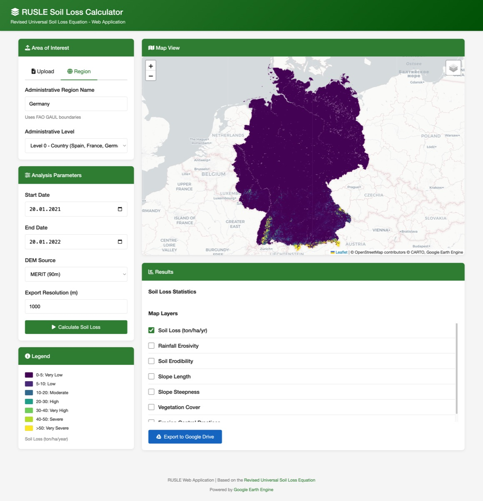

# RUSLE - Ecuación Universal de Pérdida de Suelo Revisada

¡Bienvenido a la documentación de RUSLE! Este proyecto implementa la **Ecuación Universal de Pérdida de Suelo Revisada** utilizando Google Earth Engine y Python.

<div class="grid cards" markdown>

-   :material-rocket-launch:{ .lg .middle } __Inicio Rápido__

    ---

    Comienza en minutos con nuestra guía de instalación.

    [:octicons-arrow-right-24: Comenzar](getting-started/installation.md)

-   :material-map:{ .lg .middle } __Aplicación Web__

    ---

    Usa la interfaz web interactiva para calcular la erosión del suelo.

    [:octicons-arrow-right-24: Guía de la App Web](user-guide/web-app.md)

-   :material-notebook:{ .lg .middle } __Jupyter Notebook__

    ---

    Explora y personaliza el análisis en un cuaderno interactivo.

    [:octicons-arrow-right-24: Guía del Notebook](user-guide/notebook.md)

-   :material-book-open-variant:{ .lg .middle } __Modelo RUSLE__

    ---

    Aprende sobre la ciencia detrás del modelo de erosión del suelo.

    [:octicons-arrow-right-24: Referencia del Modelo](reference/rusle-model.md)

</div>

## ¿Qué es RUSLE?

La **Ecuación Universal de Pérdida de Suelo Revisada (RUSLE)** es un modelo empírico usado para predecir la pérdida de suelo media anual a largo plazo por erosión laminar y en surcos. La ecuación es:

$$
A = R \times K \times L \times S \times C \times P
$$

Donde:

| Factor | Descripción | Unidad |
|--------|-------------|--------|
| **A** | Pérdida anual de suelo | t/ha/año |
| **R** | Factor de erosividad de la lluvia | MJ·mm/ha/h/año |
| **K** | Factor de erodibilidad del suelo | t·ha·h/ha/MJ/mm |
| **L** | Factor de longitud de pendiente | adimensional |
| **S** | Factor de inclinación de pendiente | adimensional |
| **C** | Factor de gestión de cobertura | adimensional |
| **P** | Factor de práctica de conservación | adimensional |

## Características

- 🌍 **Cobertura Global** - Usa conjuntos de datos de Google Earth Engine para análisis mundial
- 🗺️ **Mapas Interactivos** - Visualiza todos los factores RUSLE en mapas Folium
- 📁 **Múltiples Formatos de Entrada** - Soporte para Shapefiles, GeoJSON y límites administrativos
- 🐳 **Listo para Docker** - Despliegue fácil con Docker Compose
- 📊 **Exportar Resultados** - Descarga resultados a Google Drive

## Ejemplo de Salida



*Estimación de pérdida de suelo para Alemania (2021-01-20 a 2022-01-20)*

## Estructura del Proyecto

```
RUSLE/
├── app/                    # Aplicación web FastAPI
│   ├── services/           # Lógica de negocio principal
│   │   ├── gee_service.py        # Autenticación GEE
│   │   └── rusle_calculator.py   # Implementación RUSLE
│   └── routers/            # Endpoints de la API
├── 00_scripts/             # Notebooks de investigación y utilidades
│   ├── RUSLE.ipynb         # Notebook de análisis interactivo
│   └── rusle_utils.py      # Funciones utilitarias independientes
├── docs/                   # Esta documentación
└── docker-compose.yml      # Despliegue en contenedor
```

## Licencia

Este proyecto está licenciado bajo la Licencia MIT.
