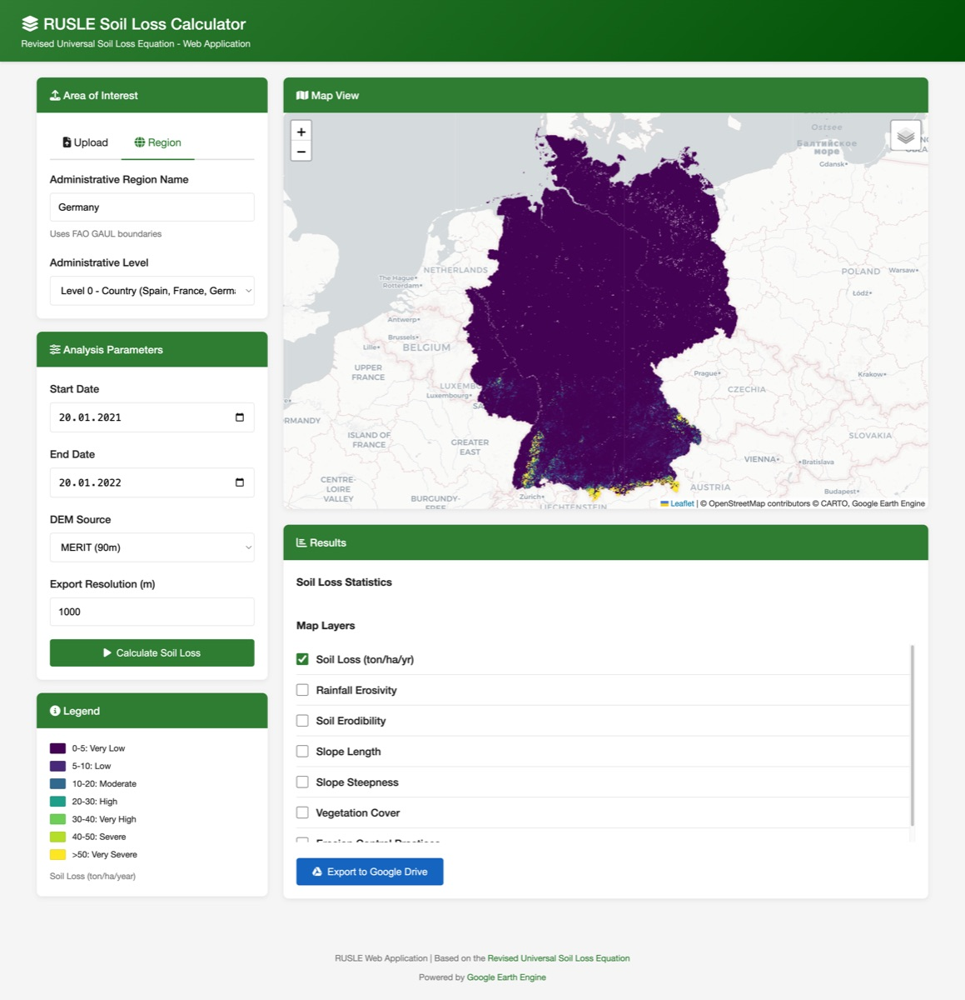

# RUSLE - Revised Universal Soil Loss Equation

Welcome to the RUSLE documentation! This project implements the **Revised Universal Soil Loss Equation** using Google Earth Engine and Python.

<div class="grid cards" markdown>

-   :material-rocket-launch:{ .lg .middle } __Quick Start__

    ---

    Get up and running in minutes with our installation guide.

    [:octicons-arrow-right-24: Getting Started](getting-started/installation.md)

-   :material-map:{ .lg .middle } __Web Application__

    ---

    Use the interactive web interface to calculate soil erosion.

    [:octicons-arrow-right-24: Web App Guide](user-guide/web-app.md)

-   :material-notebook:{ .lg .middle } __Jupyter Notebook__

    ---

    Explore and customize the analysis in an interactive notebook.

    [:octicons-arrow-right-24: Notebook Guide](user-guide/notebook.md)

-   :material-book-open-variant:{ .lg .middle } __RUSLE Model__

    ---

    Learn about the science behind the soil erosion model.

    [:octicons-arrow-right-24: Model Reference](reference/rusle-model.md)

</div>

## What is RUSLE?

The **Revised Universal Soil Loss Equation (RUSLE)** is an empirical model used to predict long-term average annual soil loss from sheet and rill erosion. The equation is:

$$
A = R \times K \times L \times S \times C \times P
$$

Where:

| Factor | Description | Unit |
|--------|-------------|------|
| **A** | Annual soil loss | t/ha/year |
| **R** | Rainfall erosivity factor | MJ·mm/ha/h/year |
| **K** | Soil erodibility factor | t·ha·h/ha/MJ/mm |
| **L** | Slope length factor | dimensionless |
| **S** | Slope steepness factor | dimensionless |
| **C** | Cover management factor | dimensionless |
| **P** | Support practice factor | dimensionless |

## Features

- 🌍 **Global Coverage** - Uses Google Earth Engine datasets for worldwide analysis
- 🗺️ **Interactive Maps** - Visualize all RUSLE factors on Folium maps
- 📁 **Multiple Input Formats** - Support for Shapefiles, GeoJSON, and administrative boundaries
- 🐳 **Docker Ready** - Easy deployment with Docker Compose
- 📊 **Export Results** - Download results to Google Drive

## Example Output



*Soil loss estimation for Germany (2021-01-20 to 2022-01-20)*

## Project Structure

```
RUSLE/
├── app/                    # FastAPI web application
│   ├── services/           # Core business logic
│   │   ├── gee_service.py        # GEE authentication
│   │   └── rusle_calculator.py   # RUSLE implementation
│   └── routers/            # API endpoints
├── 00_scripts/             # Research notebooks and utilities
│   ├── RUSLE.ipynb         # Interactive analysis notebook
│   └── rusle_utils.py      # Standalone utility functions
├── docs/                   # This documentation
└── docker-compose.yml      # Container deployment
```

## License

This project is licensed under the MIT License.
